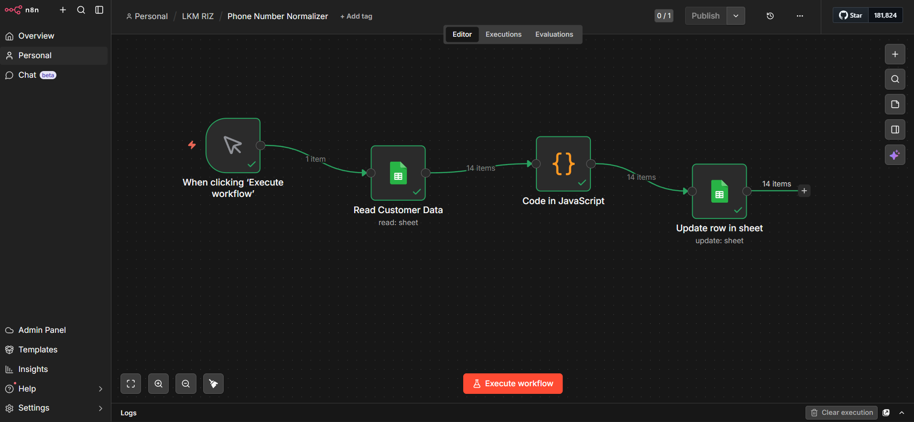

# Phone-Number-Normalizer

This workflow is an automated data cleaning and standardization pipeline designed to normalize customer phone numbers within a Google Sheets dataset. It ensures that inconsistent, manually entered phone numbers are transformed into a uniform international format and written back to the same data source for consistency.

It begins with a **Manual Trigger**, which allows the workflow to be executed on demand. This provides flexibility for running the process whenever new data is added or when updates are required, without needing full automation.

Next, the **Google Sheets (Read) node** fetches customer records from the spreadsheet. At this stage, the dataset contains raw phone numbers in inconsistent formats, including variations in prefixes, spacing, and symbols. This step serves as the data ingestion layer, bringing unstructured input into the workflow.

The workflow then moves to the **Code Node** (Normalize Phones), where JavaScript is used to clean and standardize phone numbers into an international format (e.g., +2547XXXXXXXX). It removes unwanted characters, converts local formats to international, and ensures consistent structure—improving data quality for use in APIs, CRMs, and communication systems.
This step enforces data quality and prepares the phone numbers for reliable use in systems such as APIs, CRMs, or communication tools.

Finally, the **Google Sheets (Update) node** writes the normalized phone numbers back into the same sheet. This creates a continuous data improvement loop, ensuring that the dataset remains clean, consistent, and ready for downstream usage.

### Purpose of Workflow
1. Clean and standardize phone numbers automatically.
2. Maintain consistent customer contact data.
3. Improve data quality directly within Google Sheets.

### Why This Is Powerful
1. Removes the need for manual data cleaning.
2. Ensures all phone numbers follow a single, reliable format.
3. Improves compatibility with external systems (e.g., SMS APIs).

### Use Cases
1. Preparing contact lists for messaging platforms.
2. Cleaning CRM data before integration.
3. Ensuring accurate customer communication records.

#### Additional Insights
**On-demand execution:*  Manual trigger allows controlled processing.
**Transformation-focused:* The Code node centralizes all data cleaning logic.
**Data consistency loop:* Cleaned data is written back to the source.
**Format standardization:* Aligns phone numbers to international standards for interoperability.